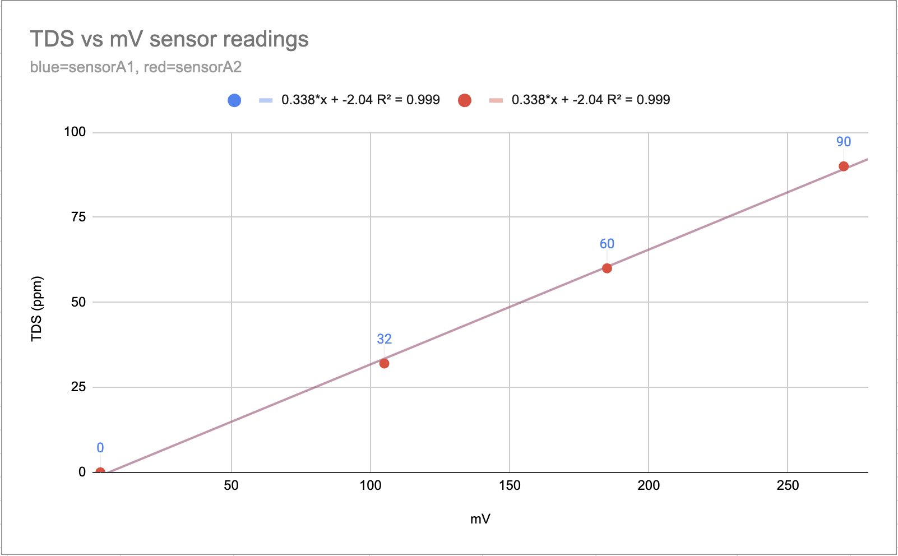

# Moonwater Monitor
This repo contains some proof of concept code to monitor water quality related sensors, adjust servo positions, and report data to Grafana for collecting and visualizing water health for a coffee shop. We use this

### Materials Used

- Raspberry pi model 3B+
- CQRobot ADS1115 16-Bit ADC Conversion Module
- CQRobot TDS meter CQRSENTDS01
- Gredia GR-301 Flowmeter Fluid Meter Counter 0.3-10L/min
- Flash Hobby M45CHW 270deg Servo
________________________________________________
### Hardware Setup
- As a prerequisite you will need to have the Raspberry Pi running with a python environment installed and ready to use
    - https://www.raspberrypi.com/documentation/computers/getting-started.html
    - If you are new to all this, look up some guides on running Python programs on Raspberry Pi and command line shell usage before continuing
- Refer to individual docs for the above hardware on how to properly connect them to a Pi GPIO pins
    for TDS readings specifically see `http://www.cqrobot.wiki/index.php/ADS1115_16-Bit_ADC_Module_SKU:_CQRADS1115`
    and `http://www.cqrobot.wiki/index.php/TDS_(Total_Dissolved_Solids)_Meter_Sensor_SKU:_CQRSENTDS01`

________________________________________________

### Code Architecture Explanation
#### Process: rasp_monitor.service
- executes Server.py to run a python flask webserver 
    - spawns a thread for reading TDS/flow values and executing servo position changes on a time interval

#### Process: prometheus.service
- executes a standard prometheus scrapper that pings the flask webserver for metrics like tds values etc
- remote write is enabled so collected metrics are pushed to prometheus cloud

#### Process: pigpiod
- process that translates GPIO commands for the servo motor
- executed manually by running `sudo pigpiod`

#### Configs
- config files control how your setup will execute so you can configure which sensors are enabled and their values. See `MW-hq-RO.yaml` as an example that uses a servo vs `MW-hq-slowbar.yaml` which is just TDS value reporting or `ExampleSingleTDSSensor.yaml` as the simplest use case.

#### Remote Service: Prometheus Cloud
- receives the data from the prometheus client running locally and stores it for query in a managed cloud instance

#### Remote Service: Grafana Cloud
- hosted version of grafana online which can create nice UI visualizations from the prometheus data

________________________________________________
### Getting Started Guide
0. Clone or copy this code into a directory on your Raspberry Pi

1. Create a python environment (https://learn.adafruit.com/python-virtual-environment-usage-on-raspberry-pi/basic-venv-usage)

2. Activate environment and install dependencies `pip install -r requirements.txt`

3. Execute individual connector python modules to make sure your sensors are working correctly.
    - Run `python tds_meter.py` to read live TDS values for example. If hooked up properly you should see readings here.

4. Run the flask server to capture sensor readings from GPIO for export
    - `python server.py ./configs/ExampleSingleTDSSensor.yaml` 
    - then in a separate window `curl localhost:5123/test_server` to confirm its up or `curl localhost:5123/metrics` to confirm sensors are reading and recording values

5. Install prometheus https://www.howtoraspberry.com/2021/02/how-to-run-prometheus-on-a-raspberry-pi/
    - use provided prometheus.yml file to remote write data to a cloud instance (refer to next section for setup)
    - this scrapes the /metrics endpoint off of the test server

6. Run both server and prometheus as systemd processes using the provided .service files `https://www.digitalocean.com/community/tutorials/how-to-use-systemctl-to-manage-systemd-services-and-units`

7. Set up remaining visualizations on Grafana cloud. Refer to next section for that.
________________________________________________
### Using Prometheus and Grafana Cloud
You could run your own instance of Prometheus and Grafana locally if you wanted since its open source and fairly easy to set up. However if you want to take advantage of free cloud computing thats available (at least at time of writing) then follow the below steps.

1. go to https://grafana.com/products/cloud/ to create an account and select Prometheus Cloud as the free datasource to use.

2. Under the Prometheus Cloud settings you will find the Connection -> Prometheus server URL, and the Authentication -> User/Password. These are secrets you will use to send data from your Raspberry Pi to the cloud. Protect these values and explore further secrets management/security if this becomes more than a small personal project

3. You should be able to have metrics sent to Prometheus cloud now and create Grafana dashboards to then visualize that data

________________________________________________
### TDS Sensor Details

Refer to http://www.cqrobot.wiki/index.php/ADS1115_16-Bit_ADC_Module_SKU:_CQRADS1115#Test_Code_for_Raspberry_Pi for sample code on reading with this sensor

I recommend recalibrating the sensor from scratch since it was really inaccurate at least for me. Here's a link to the sheet I made when calibrating my sensors: https://docs.google.com/spreadsheets/d/1TS83Euegi-WH8lnRhhCW_ktCuU0JUOk2Qdnj6UpPl88/edit?usp=sharing. There are likely better methods involving more compensation for temperature changes etc.

________________________________________________
### Water Calculations

I definitely recommend using a tool like https://coffeeadastra.com/2019/08/23/a-tool-and-videos-for-crafting-custom-brew-water/
to design your concentrate if you are going with an mineral injector type project

________________________________________________
### Followup And Feedback

Feel free to make pull requests against this repo to improve things/simplify things if you have ideas. The goal is to keep this repo as slimmed down and easy to get started with. Better error handling and proper testing will be next on the list.

If this project is useful or you have feedback please let me know! Follow us on https://www.instagram.com/moonwakecoffeeroasters/ and if you'd like to support us please stop by our cafe or a buy coffee from us :)